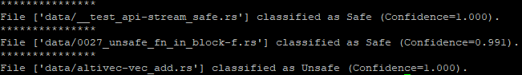

## An implementation of CORDER supporting Rust


## Data Preparation

1. Download the data from cargo-geiger repo https://github.com/yijunyu/cargo-geiger/raw/datasets/datasets/unique.tar.xz 

2. Run the script split_data to split them in train/val/test. ```python split_data.py``` 
 

After these steps, you can see the data in the treesitter_rust_train_test_val folder, splitted into 3 subfolders train\test\val. 


3. Preprocess the data

    - ```cd script```
    
    - If you want to process .rs files Run
    
        ```source process_data_rs.sh```
    -If you want to process .asm files Run
         ```source process_data_asm.sh```
        

This step will process the AST trees, which comprises of 2 steps. First, it will convert the treesitter format into our simple tree format in the form of Python dictionary. Second, it will put the trees with similar sizes into the same bucket.


## Running the model

1. To train the model:
    - ```source tbcnn_training_script.sh```
    
2. To test the model:
    - ```source tbcnn_testing_script.sh``` 
    
    
    
## Results

1. Performance on test subset:
       


0 = safe, 1= unsafe


## Inference

1. To perform automatic debugging for rust code snippets do the following steps:
    
    + ```cd inference```
    + upload the rust files on the inference/data folder
    + ```source process_data.sh```
    + ```source inference.sh```
    
    
    


