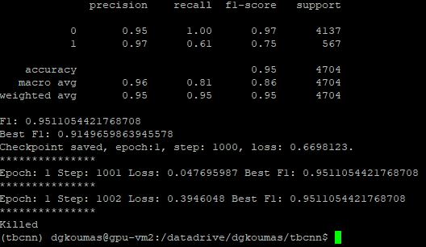
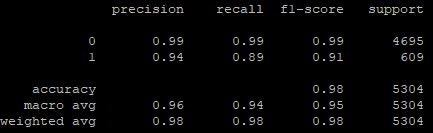

## An implementation of CORDER supporting Rust

Task and current version of CORDER: We want to discriminate safe from unsafe code snippets in Rust. For the experiments, we use Cargo-geiger dataset. The dataset includes 49,472 and 6,259 code snippets for safe and usafe categories, respectively.
In contrast to the existing CORDER implementation, the current version uses tree-sitter parser, reading raw code snippets directly, without needing the conversion of them to XML format.
The framework can support many program languages.


## Data Preparation

1. Download the data from cargo-geiger repo https://github.com/yijunyu/cargo-geiger/raw/datasets/datasets/unique.tar.xz 


2. Run the script split_data to split them in train/val/test. ```python split_data.py``` 
 

After these steps, you can see the data in the treesitter_rust_train_test_val folder, splitted into 3 subfolders train\test\val. 


3. Preprocess the data

    - ```cd script```
    
    - ```source process_data.sh```

This step will process the AST trees, which comprises of 2 steps. First, it will convert the treesitter format into our simple tree format in the form of Python dictionary. Second, it will put the trees with similar sizes into the same bucket.


## Running the model

1. To train the model:
    - ```source tbcnn_training_script.sh```
	
2. To test the model:
    - ```source tbcnn_testing_script.sh``` 
    
    
## Results

1. Performance on val subset:


	
2. Performance on test subset:
       


0 = safe, 1= unsafe

The results on test subset mean that all code snippets have been classified as safe. 


