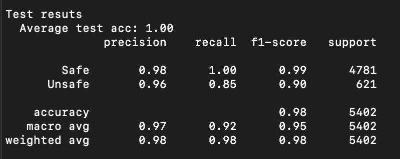

## Implementation of baselines (CNN) 


## Data Preparation

1. Follow the data preparation steps as mentioned in CodeBERT section.

    - For the baseline experiments we use code snippets that code lines are separated by ```\n```
    
### Code Snippet Tokenization 

2. Create the token vocabulary. Extract the tokens by running
    
    - ``` python tokenize_script.py --data_path ../codeBERT/data_train_test_val/train```

### Feature Extraction

3. Extract and save feutures by running.

    - ```source extract_features.sh```
    - Note that the max sequnence length of code snippets equals 80 tokens.
    - After running the script, input_ids, masks, and labels will be saved in ```data/``` folder.
    
    
### Training

4. To train the CNN model run    
    - ```python train.py --model CNN```
    
5. To train the BiLDTM model run    
    - ```python train.py --model BiLSTM```    
    
    
### Testing

6. To test the CNN model run    
    - ```python test.py --model CNN``` 
    
7. To test the BiLSTM model run   
- ```python test.py --model BiLSTM```  
    
### Results


1. CNN Performance on test subset:
       
       


