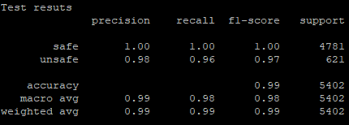

## CodeBERT


## Data Preparation

1. Download the data from repo https://github.com/yijunyu/cargo-geiger/blob/datasets/datasets/unique-indented.tar.bz2?raw=true
2. ```mkdir data```
3. ```tar -xf unique-indented.tar.bz2 -C data/```
4. Run the script split_data to split them in train/val/test. ```python split_data.py``` 
 

After these steps, you can see the data in the treesitter_rust_train_test_val folder, splitted into 3 subfolders train\test\val. 

### The following step is optional in case you want to increase the amount of unsafe code snippets when you run experiments on the assebmply task.
    ```source create_synthetic_data.sh```

3. Preprocess the data

    
    - ```source process_data_rs.sh``` tp process high-level program language, i.e., code snippets in rust
    - ```source process_data_asm.sh``` tp process low-level program language, i.e., assemply
    
    

This step will process the data and save input_ids, attention_masks, and labels to pickle files for the train, val, and test subdatasets.

## Runnig the model

1. To fine-tune the model: 
     - ```python train.py```

2. To test the model:
    - ```python test.py```
    
## Results

1. Performance on test subset:
       


0 = safe, 1= unsafe

#Inference

1. Move to ```inference/``` folder
     - ```cd inference```
2. Upload the data on ```data/``` folder         
 
3. To extract features run  
    - ```python process_data```
    
4. Download the pre-trained model from ```s3://bertrust/codeBERT_pl.bin``` and upload it to ```model/``` forlder

5. Run the inference script
    - ```python infer.py```
